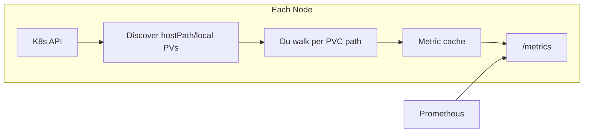
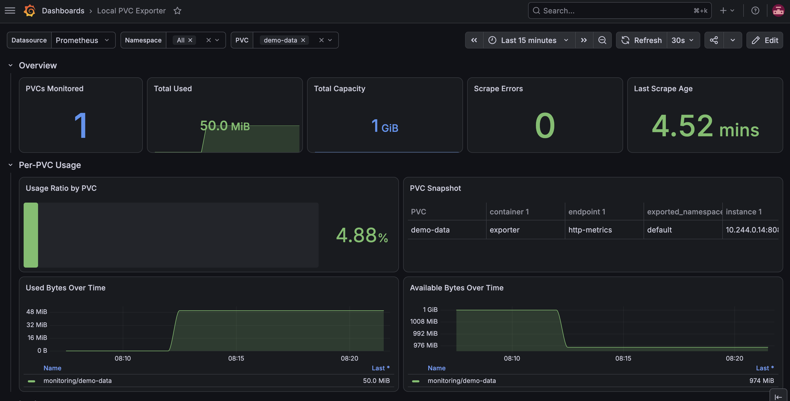

<div align="center">

# 💾 Local PVC Exporter

<h3>Per PVC storage metrics for Kubernetes</h3>

<sub><em>When kubelet stats aren't enough</em></sub>

<br>

[](https://github.com/alvarorg14/local-pvc-exporter/actions/workflows/ci.yml)
[](https://github.com/alvarorg14/local-pvc-exporter/actions/workflows/release.yml)
[](https://github.com/alvarorg14/local-pvc-exporter/releases)
[](https://github.com/alvarorg14/local-pvc-exporter/blob/main/go.mod)
[](https://goreportcard.com/report/github.com/alvarorg14/local-pvc-exporter)
[](https://github.com/alvarorg14/local-pvc-exporter/blob/main/LICENSE)
[](https://github.com/alvarorg14/local-pvc-exporter/pkgs/container/local-pvc-exporter)
[](https://github.com/alvarorg14/local-pvc-exporter/pkgs/container/charts%2Flocal-pvc-exporter)
[](https://github.com/alvarorg14/local-pvc-exporter/pulls)

<br>

[](https://go.dev/)
[](https://kubernetes.io/)
[](https://prometheus.io/)
[](https://helm.sh/)
[](https://www.docker.com/)

<br>

[Quick Start](#-quick-start-helm) · [Metrics](#-metrics) · [Configuration](#%EF%B8%8F-configuration) · [Contributing](#-contributing)

</div>

---

## 📋 Table of Contents

- [Overview](#-overview)
- [Why local-pvc-exporter?](#-why-local-pvc-exporter)
- [Features](#-features)
- [Metrics](#-metrics)
- [Quick Start (Helm)](#-quick-start-helm)
- [Configuration](#%EF%B8%8F-configuration)
- [How It Works](#-how-it-works)
- [Dashboard](#-dashboard)
- [Local Development](#-local-development)
- [Troubleshooting](#-troubleshooting)
- [Example PromQL](#-example-promql)
- [Contributing](#-contributing)
- [Security](#-security)
- [License](#-license)

---

## 📖 Overview

A Prometheus exporter for **per-PVC storage metrics** on Kubernetes clusters where `kubelet_volume_stats_*` metrics are missing or inaccurate.

The exporter runs as a **DaemonSet**, walks each PVC's data directory on the node (du-style), and exposes accurate capacity and usage metrics with standard Kubernetes labels.

## 🤔 Why local-pvc-exporter?

Designed for **hostPath** and **local** PersistentVolumes — common in k3s and edge deployments — where:

- `hostPath` PVs do not emit `kubelet_volume_stats_*` metrics at all
- `local` PVs report filesystem-level stats instead of per-volume usage

## ✨ Features

- Per-PVC metrics for `hostPath` and `local` volume types
- Du-style used capacity measurement (inode de-duplication, single-filesystem boundary)
- Configurable metric prefix, scrape interval, and output unit
- Prometheus-compatible `/metrics` endpoint
- Helm chart with RBAC, DaemonSet, Service, and optional ServiceMonitor
- Runs in a distroless container as root with only `CAP_DAC_READ_SEARCH` for read-only PVC traversal

## 📊 Metrics

Default prefix: `local_pvc` (configurable). Default unit: `bytes`.

| Metric | Description |
|--------|-------------|
| `local_pvc_capacity_bytes` | Declared PVC capacity |
| `local_pvc_used_bytes` | Measured used capacity (du-style) |
| `local_pvc_available_bytes` | Capacity minus used (clamped at 0) |
| `local_pvc_used_ratio` | Used / capacity ratio (0..1) |
| `local_pvc_inodes_used` | File and directory count in the PVC data path (du-style) |
| `local_pvc_inodes` | Total filesystem inodes (equivalent to `kubelet_volume_stats_inodes`) |
| `local_pvc_inodes_free` | Free filesystem inodes (equivalent to `kubelet_volume_stats_inodes_free`) |
| `local_pvc_scrape_duration_seconds` | Last scrape duration |
| `local_pvc_scrape_errors_total` | Cumulative scrape errors |
| `local_pvc_last_scrape_timestamp_seconds` | Unix timestamp of last scrape |

**Labels:** `persistentvolumeclaim`, `namespace`, `persistentvolume`, `storageclass`, `node`, `volume_type`

> **Note:** Inode metrics differ in scope. `local_pvc_inodes` and `local_pvc_inodes_free` are filesystem-level (the whole backing disk for local/hostPath volumes, matching kubelet behavior), while `local_pvc_inodes_used` is a per-PVC du-style count of files and directories inside the volume path and therefore intentionally differs from `kubelet_volume_stats_inodes_used` on k3s and similar setups.

When using non-byte units (`kib`, `mib`, `gib`), the metric suffix changes accordingly (e.g. `local_pvc_used_kib`).

## 🚀 Quick Start (Helm)

> **New here?** See [QUICKSTART.md](QUICKSTART.md) for a step-by-step get-running guide.

Container images are published to `ghcr.io/alvarorg14/local-pvc-exporter` on release (tags: `vX.Y.Z`, `X.Y`, `latest`). The Helm chart is published to `oci://ghcr.io/alvarorg14/charts/local-pvc-exporter` and uses this image by default.

```bash
helm install local-pvc-exporter oci://ghcr.io/alvarorg14/charts/local-pvc-exporter \
  --version X.Y.Z \
  --namespace monitoring \
  --create-namespace
```

Enable Prometheus Operator scraping:

```bash
helm install local-pvc-exporter oci://ghcr.io/alvarorg14/charts/local-pvc-exporter \
  --version X.Y.Z \
  --namespace monitoring \
  --create-namespace \
  --set serviceMonitor.enabled=true
```

For local development, install from the chart source:

```bash
helm install local-pvc-exporter ./charts/local-pvc-exporter \
  --namespace monitoring \
  --create-namespace
```

## ⚙️ Configuration

| Flag / Env | Default | Description |
|------------|---------|-------------|
| `--metric-prefix` / `METRIC_PREFIX` | `local_pvc` | Prefix for all metrics |
| `--scrape-interval` / `SCRAPE_INTERVAL` | `5m` | Interval between PVC scans |
| `--unit` / `UNIT` | `bytes` | Output unit: `bytes`, `kib`, `mib`, `gib` |
| `--listen-address` / `LISTEN_ADDRESS` | `:8080` | HTTP listen address |
| `--host-root` / `HOST_ROOT` | `/host` | Host filesystem mount inside pod |
| `--node-name` / `NODE_NAME` | *(required)* | Node name (set via downward API in Helm) |
| `--du-concurrency` / `DU_CONCURRENCY` | `4` | Max concurrent du operations |
| `--du-timeout` / `DU_TIMEOUT` | `10m` | Per-volume du timeout |
| `--kubeconfig` / `KUBECONFIG` | *(empty)* | Kubeconfig path (in-cluster if empty) |

### Helm values

```yaml
metricPrefix: local_pvc
scrapeInterval: 5m
unit: bytes
hostRoot: /host
hostRootMountPath: /
duConcurrency: 4
duTimeout: 10m
serviceMonitor:
  enabled: true
```

## 🔧 How It Works



1. Each DaemonSet pod discovers `hostPath` and `local` PVs bound to PVCs on its node.
2. `local` PVs are matched via node affinity; `hostPath` PVs are measured when the path exists under the host mount.
3. Used bytes are computed by walking the directory tree under the mounted host root.
4. Metrics are cached and refreshed on the configured interval; Prometheus scrapes `/metrics` cheaply.

## 📈 Dashboard

<div align="center">

<!-- Drop your Grafana dashboard screenshot at assets/grafana-dashboard.png -->


*Add a Grafana dashboard screenshot at `assets/grafana-dashboard.png` to showcase PVC usage panels.*

</div>

## 💻 Local Development

Requires Go 1.23+ and [golangci-lint](https://golangci-lint.run/) for linting.

Run `make help` to list all available targets:

```bash
# Run tests (go test -race ./...)
make test

# Build binary to bin/local-pvc-exporter
make build

# Lint (golangci-lint run)
make lint

# Run locally (requires kubeconfig and NODE_NAME)
make run
```

See [AGENTS.md](AGENTS.md) for architecture details and AI assistant guidelines.

## 🔍 Troubleshooting

### `du failed ... permission denied` on PVC data directories

If logs show errors like `open .../pgdata: permission denied`, the exporter cannot traverse directories owned by other UIDs with restrictive modes (e.g. PostgreSQL `pgdata` at `0700`). The default Helm values run the container as root with only `CAP_DAC_READ_SEARCH` added — this bypasses read/execute permission checks without granting write access. The host filesystem mount remains read-only.

After upgrading, confirm `scrape complete` reports the expected volume count with `errors: 0`, and that `local_pvc_used_bytes` is populated for affected PVCs.

## 📉 Example PromQL

```promql
# PVC usage ratio
local_pvc_used_ratio{namespace="default"}

# PVCs over 80% full
local_pvc_used_ratio > 0.8

# Available space in bytes
local_pvc_available_bytes{persistentvolumeclaim="my-data"}
```

## 🤝 Contributing

Contributions are welcome! Issues and pull requests help make this project better for everyone.

- Read [CONTRIBUTING.md](CONTRIBUTING.md) for the development workflow
- Follow our [Code of Conduct](CODE_OF_CONDUCT.md)
- See [AGENTS.md](AGENTS.md) if you're an AI assistant or want deeper architecture context

## 🔒 Security

If you discover a security vulnerability, please report it via a [private GitHub security advisory](https://github.com/alvarorg14/local-pvc-exporter/security/advisories/new). Do **not** open a public issue.

See [SECURITY.md](SECURITY.md) for the full security policy.

## 📄 License

[](https://opensource.org/licenses/Apache-2.0)

Apache License 2.0 — see [LICENSE](LICENSE).

---

<div align="center">

Made with ❤️ using Go, Kubernetes, and Prometheus

</div>
