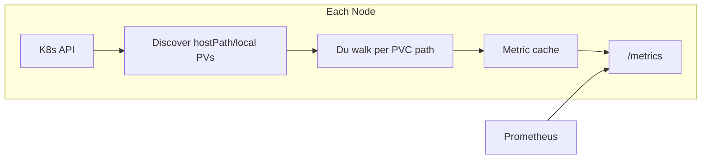

# local-pvc-exporter

A Prometheus exporter for **per-PVC storage metrics** on Kubernetes clusters where `kubelet_volume_stats_*` metrics are missing or inaccurate.

Designed for **hostPath** and **local** PersistentVolumes — common in k3s and edge deployments — where:

- `hostPath` PVs do not emit `kubelet_volume_stats_*` metrics at all
- `local` PVs report filesystem-level stats instead of per-volume usage

The exporter runs as a **DaemonSet**, walks each PVC's data directory on the node (du-style), and exposes accurate capacity and usage metrics with standard Kubernetes labels.

## Features

- Per-PVC metrics for `hostPath` and `local` volume types
- Du-style used capacity measurement (inode de-duplication, single-filesystem boundary)
- Configurable metric prefix, scrape interval, and output unit
- Prometheus-compatible `/metrics` endpoint
- Helm chart with RBAC, DaemonSet, Service, and optional ServiceMonitor
- Runs as non-root in a distroless container

## Metrics

Default prefix: `local_pvc` (configurable). Default unit: `bytes`.

| Metric | Description |
|--------|-------------|
| `local_pvc_capacity_bytes` | Declared PVC capacity |
| `local_pvc_used_bytes` | Measured used capacity (du-style) |
| `local_pvc_available_bytes` | Capacity minus used (clamped at 0) |
| `local_pvc_used_ratio` | Used / capacity ratio (0..1) |
| `local_pvc_inodes_used` | File and directory count |
| `local_pvc_scrape_duration_seconds` | Last scrape duration |
| `local_pvc_scrape_errors_total` | Cumulative scrape errors |
| `local_pvc_last_scrape_timestamp_seconds` | Unix timestamp of last scrape |

**Labels:** `persistentvolumeclaim`, `namespace`, `persistentvolume`, `storageclass`, `node`, `volume_type`

When using non-byte units (`kib`, `mib`, `gib`), the metric suffix changes accordingly (e.g. `local_pvc_used_kib`).

## Quick start (Helm)

```bash
helm install local-pvc-exporter ./charts/local-pvc-exporter \
  --namespace monitoring \
  --create-namespace
```

Enable Prometheus Operator scraping:

```bash
helm install local-pvc-exporter ./charts/local-pvc-exporter \
  --namespace monitoring \
  --create-namespace \
  --set serviceMonitor.enabled=true
```

## Configuration

| Flag / Env | Default | Description |
|------------|---------|-------------|
| `--metric-prefix` / `METRIC_PREFIX` | `local_pvc` | Prefix for all metrics |
| `--scrape-interval` / `SCRAPE_INTERVAL` | `5m` | Interval between PVC scans |
| `--unit` / `UNIT` | `bytes` | Output unit: `bytes`, `kib`, `mib`, `gib` |
| `--listen-address` / `LISTEN_ADDRESS` | `:8080` | HTTP listen address |
| `--host-root` / `HOST_ROOT` | `/host` | Host filesystem mount inside pod |
| `--node-name` / `NODE_NAME` | *(required)* | Node name (set via downward API in Helm) |
| `--du-concurrency` / `DU_CONCURRENCY` | `4` | Max concurrent du operations |
| `--du-timeout` / `DU_TIMEOUT` | `10m` | Per-volume du timeout |
| `--kubeconfig` / `KUBECONFIG` | *(empty)* | Kubeconfig path (in-cluster if empty) |

### Helm values

```yaml
metricPrefix: local_pvc
scrapeInterval: 5m
unit: bytes
hostRoot: /host
hostRootMountPath: /
duConcurrency: 4
duTimeout: 10m
serviceMonitor:
  enabled: true
```

## How it works



1. Each DaemonSet pod discovers `hostPath` and `local` PVs bound to PVCs on its node.
2. `local` PVs are matched via node affinity; `hostPath` PVs are measured when the path exists under the host mount.
3. Used bytes are computed by walking the directory tree under the mounted host root.
4. Metrics are cached and refreshed on the configured interval; Prometheus scrapes `/metrics` cheaply.

## Local development

```bash
# Run tests
make test

# Build
make build

# Run locally (requires kubeconfig and NODE_NAME)
NODE_NAME=$(kubectl get nodes -o jsonpath='{.items[0].metadata.name}') \
  go run ./cmd/local-pvc-exporter --host-root=/
```

## Example PromQL

```promql
# PVC usage ratio
local_pvc_used_ratio{namespace="default"}

# PVCs over 80% full
local_pvc_used_ratio > 0.8

# Available space in bytes
local_pvc_available_bytes{persistentvolumeclaim="my-data"}
```

## License

Apache License 2.0 — see [LICENSE](LICENSE).

## Contributing

See [CONTRIBUTING.md](CONTRIBUTING.md).
